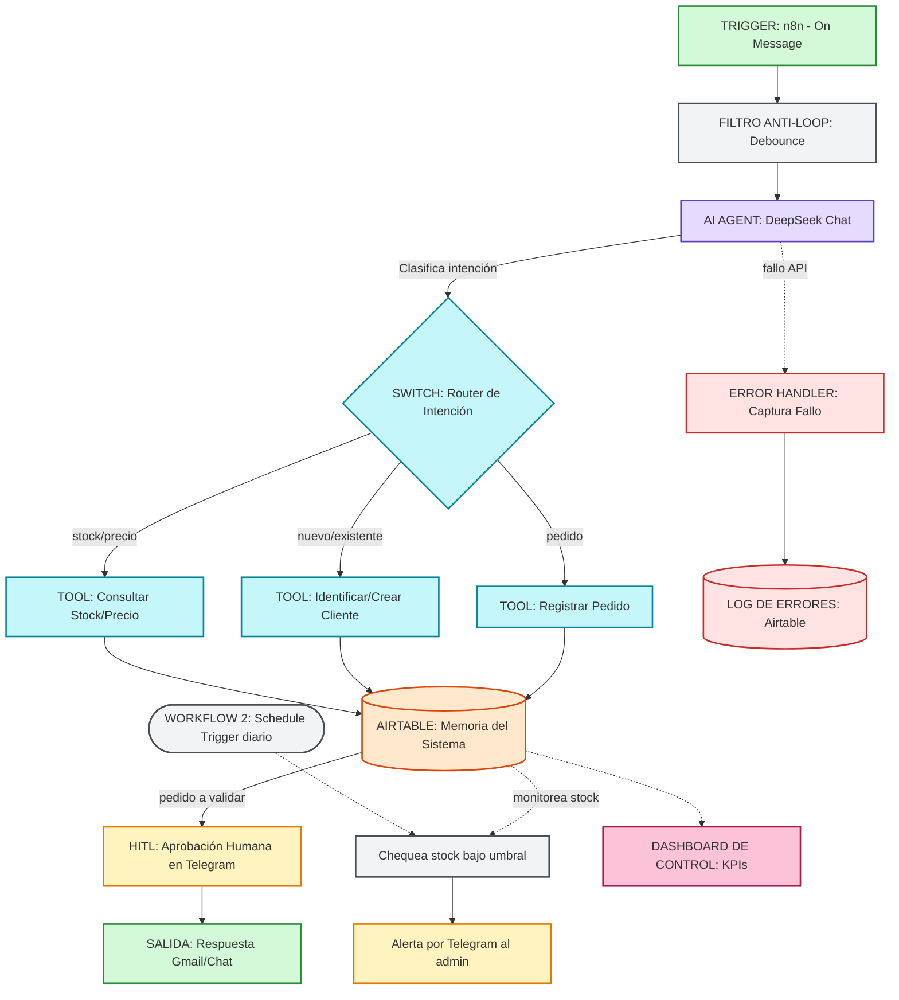

```mermaid
graph TD
    %% Definición de colores
    classDef verde fill:#d3f9d8,stroke:#2b8a3e,stroke-width:2px;
    classDef gris fill:#f1f3f5,stroke:#495057,stroke-width:2px;
    classDef violeta fill:#e5dbff,stroke:#5f3dc4,stroke-width:2px;
    classDef celeste fill:#c5f6fa,stroke:#0c8599,stroke-width:2px;
    classDef naranja fill:#ffe8cc,stroke:#d9480f,stroke-width:2px;
    classDef amarillo fill:#fff3bf,stroke:#e67700,stroke-width:2px;
    classDef rojo fill:#ffe3e3,stroke:#c92a2a,stroke-width:2px;
    classDef rosa fill:#fcc2d7,stroke:#a61e4d,stroke-width:2px;

    %% Flujo Principal
    A[TRIGGER: n8n - On Message]:::verde --> B[FILTRO ANTI-LOOP: Debounce]:::gris
    B --> C[AI AGENT: DeepSeek Chat]:::violeta
    
    C -->|Clasifica intención| D{SWITCH: Router de Intención}:::celeste
    
    %% Ramas del Switch
    D -->|stock/precio| E[TOOL: Consultar Stock/Precio]:::celeste
    D -->|nuevo/existente| F[TOOL: Identificar/Crear Cliente]:::celeste
    D -->|pedido| G[TOOL: Registrar Pedido]:::celeste

    %% Base de Datos
    E --> H[(AIRTABLE: Memoria del Sistema)]:::naranja
    F --> H
    G --> H

    %% HITL y Salida
    H -->|pedido a validar| I[HITL: Aprobación Humana en Telegram]:::amarillo
    I --> J[SALIDA: Respuesta Gmail/Chat]:::verde

    %% Manejo de Errores
    C -.->|fallo API| K[ERROR HANDLER: Captura Fallo]:::rojo
    K --> L[(LOG DE ERRORES: Airtable)]:::rojo

    %% Workflows Secundarios y Monitoreo
    M([WORKFLOW 2: Schedule Trigger diario]):::gris -.-> N[Chequea stock bajo umbral]:::gris
    H -.->|monitorea stock| N
    N --> O[Alerta por Telegram al admin]:::amarillo
    
    H -.-> P[DASHBOARD DE CONTROL: KPIs]:::rosa
```
